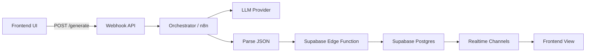
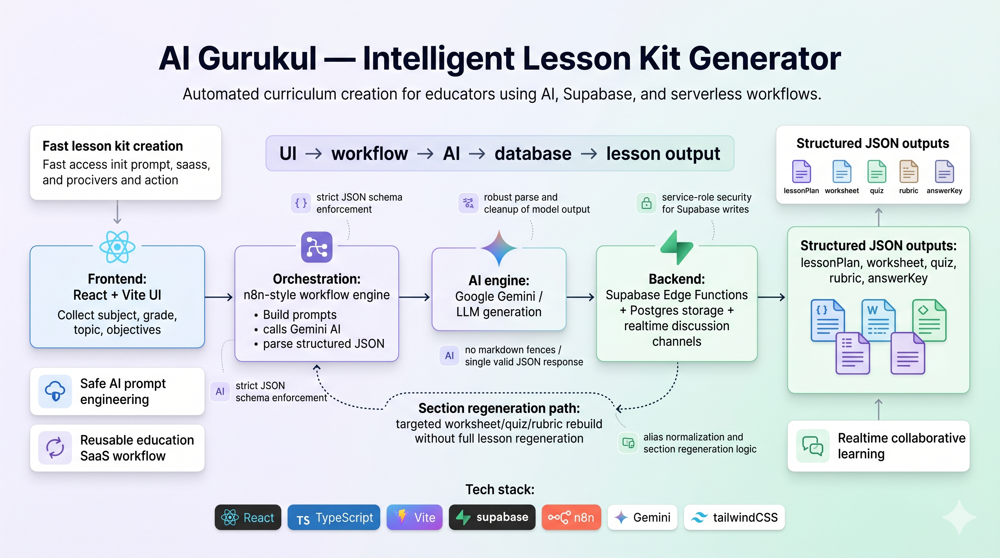
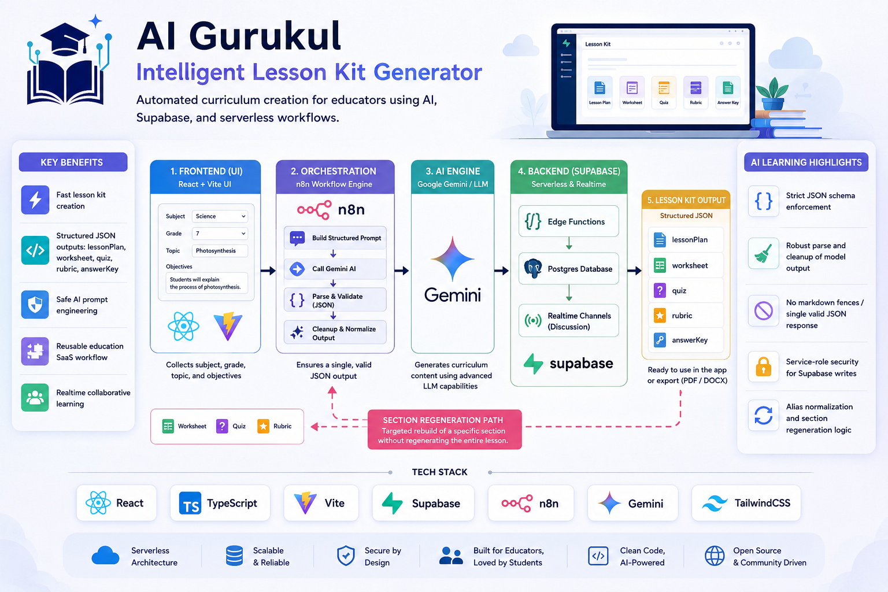

# AI Gurukul — Intelligent Lesson Kit Generator

[](https://reactjs.org)
[](https://www.typescriptlang.org)
[](https://vitejs.dev)
[](https://supabase.com)
[](https://n8n.io)
[](https://cloud.google.com/vertex-ai)
[](https://tailwindcss.com)

## Project Title

**Project Title**: AI Gurukul — Intelligent Lesson Kit Generator

## 🚀 Product Overview

- **AI Gurukul** is a developer-focused SaaS portfolio project that generates complete, grade-appropriate lesson kits (lesson plans, worksheets, quizzes, rubrics, answer keys) using LLMs plus serverless edge functions and a Supabase backend. It provides curriculum designers and educators with quick, production-ready teaching materials.

## 🧩 Problem Solved

- Curriculum creation is time-consuming and repetitive. AI Gurukul automates high-quality lesson generation while keeping materials structured and exportable for LMS integration.

## 🏗️ Solution Architecture

- A frontend React app collects inputs (subject, grade, topic, objectives) and calls serverless endpoints that orchestrate LLM calls, parse structured JSON outputs, and persist results into a Supabase Postgres instance. Background workflows (n8n-style JSON in `Backend/`) glue AI calls to Supabase Edge Functions.



## 🚀 Features

- **Automated lesson generation**: Generate a complete lesson kit in one request 🧠
- **Structured outputs**: Outputs are validated JSON objects (lessonPlan, worksheet, quiz, rubric, answerKey) ✅
- **Supabase backend**: Persists lessons and enables realtime discussions 💾
- **Serverless edge functions**: Fast, secure function endpoints for saving and regenerating content ⚡
- **Regeneration tools**: Regenerate specific sections (worksheet, quiz) without overwriting the full lesson 🔁
- **Exportable content**: Download or integrate generated kits with LMS systems 📥

## 🔄 Workflow Explanation

1. Educator fills input form in the frontend UI ([Frontend/ai-gurukul-28-main/src/index.tsx](Frontend/ai-gurukul-28-main/src/index.tsx)).
2. Frontend calls an orchestration webhook (the `Backend/` workflow JSONs define these webhook-based flows).
3. Orchestrator calls an LLM (Gemini/OpenAI) to generate a single valid JSON object.
4. The workflow parses, validates, and POSTs the structured JSON to a Supabase Edge Function (see `Frontend/ai-gurukul-28-main/supabase/functions/`).
5. Supabase stores the lesson and triggers real-time updates; users can view and discuss inside the lesson UI.

## 🛠️ Tech Stack

- **Frontend**: React + Vite (see [Frontend/ai-gurukul-28-main/package.json](Frontend/ai-gurukul-28-main/package.json))
- **Backend/workflows**: n8n-style JSON workflows in `Backend/` that orchestrate AI calls
- **AI provider**: Google Gemini / OpenAI for content generation
- **Database/Auth**: Supabase (Edge Functions + Postgres + Realtime)
- **Integrations**: n8n/webhooks, ngrok (for dev webhooks)

## ⚙️ Installation Steps

### Clone repository

```bash
git clone <repo-url>
cd AI-Gurukul
```

### Run frontend locally

```bash
cd Frontend/ai-gurukul-28-main
bun install   # or npm install
bun dev       # or npm run dev
```

### Deploy backend

- Supabase & Edge functions: follow Supabase CLI or Dashboard to deploy `/Frontend/ai-gurukul-28-main/supabase/functions`
- n8n / workflow: import the JSON workflows from `Backend/` into your n8n instance or equivalent orchestrator.

## 🔐 Environment Variables

(use `.env` files; do NOT commit secrets)

### Frontend example (`Frontend/ai-gurukul-28-main/.env`)

```bash
SUPABASE_PUBLISHABLE_KEY=__SUPABASE_PUBLISHABLE_KEY_PLACEHOLDER__
SUPABASE_URL=https://<SUPABASE_PROJECT_ID>.supabase.co
VITE_SUPABASE_PROJECT_ID=__SUPABASE_PROJECT_ID_PLACEHOLDER__
VITE_SUPABASE_PUBLISHABLE_KEY=__SUPABASE_PUBLISHABLE_KEY_PLACEHOLDER__
VITE_SUPABASE_URL=https://<SUPABASE_PROJECT_ID>.supabase.co
VITE_N8N_WEBHOOK_URL=https://your-ngrok-url-or-webhook.local
```

### Backend / workflow placeholders

```bash
GOOGLE_API_KEY=__GOOGLE_API_KEY_PLACEHOLDER__
SUPABASE_SERVICE_ROLE_KEY=__SUPABASE_SERVICE_ROLE_KEY_PLACEHOLDER__
```

## 🖼️ Screenshots & GIF Demos

- Add screenshots and GIFs to the `Screenshots/` directory.
- Example references (place files there):
  - `Screenshots/AI_Gurukul - Homepage1.png`
  - `Screenshots/AI_Gurukul - Dashboard.png`
  - `Screenshots/AI_Gurukul - Generate_Lesson.png`

### Preview images


### Project Explainer Images





## 📈 Architecture Diagrams

- See the mermaid diagram above. For a printable PNG, export the mermaid graph with your preferred tool and place it in `Screenshots/architecture.png`.

## 🌐 Deployment Links

- Frontend (example): https://your-frontend-deploy.example.com
- Supabase Project (console): https://app.supabase.com/project/<SUPABASE_PROJECT_ID>
- n8n (orchestrator): https://your-n8n.example.com

(Replace placeholders with your actual deployment URLs once deployed.)

## 🛣️ Future Roadmap

- Add user accounts and multi-tenant support (organization-level content)
- Add content versioning and audit logs
- Improve LLM safety pipelines and hallucination detection
- Add direct LMS export (Canvas, Moodle) and SCORM packaging
- Add analytics dashboard for lesson usage and student engagement

## 👤 Creator Information

- Creator: Your Name — AI / EdTech Engineer
- GitHub: https://github.com/yourusername
- Email: your.email@example.com

## 📄 License

- see LICENSE file for details

---
